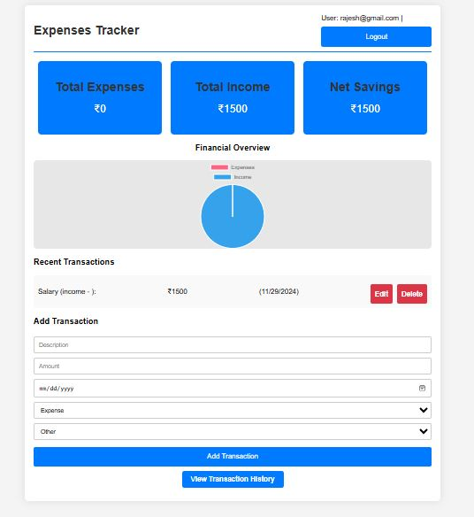
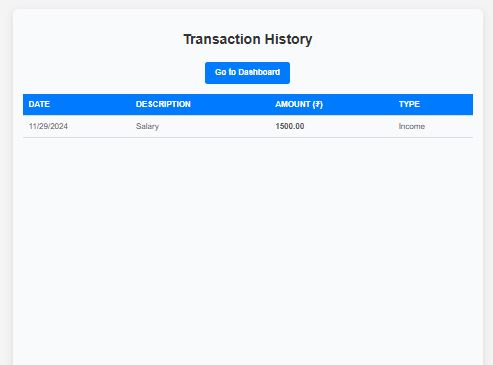

<h1>Expense Tracker</h1>
Expense Tracker is a React-based web application that helps you track your income and expenses category-wise, such as salary, traveling, and more. It features a dynamic dashboard with a pie chart to visualize income and expense ratios, and a transaction history module to display all past transactions.

<h2>Features</h2>
<b>Add Transactions</b>: Record income or expense transactions with specific categories. 
<b>Dynamic Dashboard</b>: Visualize income vs. expenses through a pie chart. 
<b>Transaction History</b>: View and manage all past transactions. 
<b>Category-Wise Tracking</b>: Organize your finances by categories such as salary, traveling, or others. 
<b>Database Integration</b>: All transactions are stored in a MongoDB database. 
<h2>Pre Required</h2>
<li>Install Node.js (v16 or later recommended).</li>
<li>Install MongoDB and ensure it is running on your system or use a cloud-based MongoDB service like MongoDB Atlas.</li>
<li>Install Git for version control.</li>

<h2>How To Set Up Backend and Frontend</h2>
<ul>
  <li><b>Database Name</b>: [View the .env file here](Backend/.env)
</li>
</ul>
<h3>How To Set Backend</h3>
<li>Navigate to the Backend folder: cd backend</li>
<li>Install dependencies: npm i</li>
<li>Start the backend server: npm start</li>
<h3>How To Set Frontend</h3>
<li>Navigate to the frontend folder:cd backend</li>
<li>Install dependencies:npm i</li>
<li>Start the frontend : npm start</li>

<h3>npm install(npm i)</h3>

Installs all the dependencies listed in the package.json file for the project.

<h3>npm start</h3>

Starts the application, running the development server locally.

### Dashboard View

### Transaction Histroy

